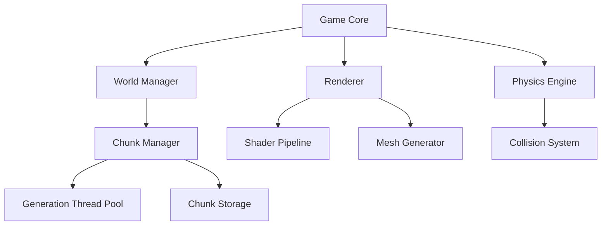

<div align="center">

# 🎮 PyVoxel
### A High-Performance Voxel Engine Built with Python

[](https://www.python.org)
[](https://www.opengl.org)
[](LICENSE)
[](https://github.com/psf/black)
[](https://your-docs-url.com)

[Features](#✨-features) • [Quick Start](#⚡-quick-start) • [Architecture](#🏗️-architecture) • [Performance](#⚡️-performance) • [Development](#👨‍💻-development) • [Contributing](#👥-contributing)


*Create, explore, and modify infinite procedurally generated worlds*

</div>

## ✨ Features

### 🌍 World Generation & Management
- **Infinite Terrain:** Seamless procedural generation using multiple noise algorithms
- **Biome System:** Dynamic biome generation with smooth transitions
- **Multi-threaded Chunk Loading:** Asynchronous chunk generation and management
- **Smart Caching:** LRU cache system for optimal memory usage

### 🎨 Graphics Engine
- **Modern OpenGL Pipeline:** Utilizing OpenGL 3.3+ features
- **Advanced Shading:** PBR materials, dynamic lighting, and shadows
- **Optimized Rendering:**
  - Frustum culling with octree acceleration
  - Instanced rendering for identical elements
  - Texture arrays for efficient material management
  - Greedy meshing for optimal vertex counts

### 🎮 Gameplay & Interaction
- **Physics System:** Real-time collision detection and response
- **Advanced Controls:**
  - Fluid player movement with acceleration and momentum
  - Precise voxel manipulation with ray-casting
  - Customizable key bindings
- **Build Tools:** Creative and survival modes with different tool sets

### 🛠️ Technical Architecture
- **Entity Component System (ECS):** Flexible and performant game object management
- **Event System:** Decoupled communication between systems
- **Mod Support:** Plugin architecture for extending functionality
- **Save System:** Efficient chunk serialization and world persistence

## ⚡ Quick Start

```bash
# Installation
git clone https://github.com/Shubhayu15/PYVOXEL-Procedural-World.git
cd PYVOXEL-Procedural-World
python -m venv venv
source venv/bin/activate  # or `venv\Scripts\activate` on Windows
pip install -r requirements.txt

# Running
python main.py --world-size 512 --render-distance 12 --seed 12345
```

### 🎮 Controls & Commands

| Category | Action | Default Key |
|----------|--------|-------------|
| **Movement** | Forward/Back | W/S |
|  | Left/Right | A/D |
|  | Fly Up/Down | Space |
| **Building** | Place Block | Right Click |
|  | Break Block | Left Click |
|  | Pick Block | Middle Click |

## 🏗️ Architecture



### Key Components

#### 1. World Generation Pipeline
```python
class WorldGenerator:
    def __init__(self, seed: int):
        self.seed = seed
        self.noise = FastNoiseLite(seed)
        self.biome_noise = FastNoiseLite(seed + 1)
        
    def generate_chunk(self, chunk_pos: Vec3) -> Chunk:
        # Layered noise generation
        base_terrain = self.noise.generate_3d(chunk_pos)
        biome_data = self.biome_noise.generate_2d(chunk_pos)
        return self._compose_chunk(base_terrain, biome_data)
```

#### 2. Rendering Pipeline


## ⚡️ Performance

### Benchmarks
| Metric | Value | Notes |
|--------|-------|-------|
| Chunk Generation | ~5ms | Per 16x16x16 chunk |
| Render Time | ~2ms | At 12 chunk distance |
| Memory Usage | ~250MB | With 32 chunks loaded |
| Save Size | ~1MB | Per region file |

### Optimization Techniques

1. **Mesh Optimization:**
   - Greedy meshing reduces vertex count by 70-80%
   - Texture atlasing minimizes state changes
   - Geometry instancing for repeated structures

2. **Memory Management:**
   - Chunk pooling and recycling
   - Compressed voxel storage (16 bits per voxel)
   - Dynamic LOD system for distant chunks

## 👨‍💻 Development

### Project Structure
```
pyvoxel/
├── src/
│   ├── core/           # Core engine components
│   ├── world/          # World generation and management
│   ├── graphics/       # Rendering and shaders
│   ├── physics/        # Collision and physics
│   └── utils/          # Helper functions and tools
├── assets/
│   ├── textures/       # Texture files and atlases
│   ├── shaders/        # GLSL shader programs
│   └── models/         # 3D models and meshes
├── docs/               # Documentation
└── tests/              # Unit and integration tests
```

### Development Tools
- **Testing:** PyTest for unit and integration testing
- **Profiling:** cProfile and memory_profiler
- **Documentation:** MkDocs with material theme
- **CI/CD:** GitHub Actions for automated testing and deployment

## 👥 Contributing

### Getting Started
1. Fork the repository
2. Set up development environment:
   ```bash
   make dev-setup
   pre-commit install
   ```
3. Create a feature branch
4. Make your changes
5. Run tests: `make test`
6. Submit a pull request

### Code Style
- Follow PEP 8 guidelines
- Use type hints
- Add docstrings for all public functions
- Include unit tests for new features

[Previous sections remain the same...]

## 🚀 Development Journey

Follow our step-by-step development process to understand how PyVoxel was built from the ground up:

### Step 1: Creating OpenGL Window


```python
import moderngl
import pygame

class Game:
    def __init__(self):
        pygame.init()
        self.ctx = moderngl.create_context()
        self.window = pygame.display.set_mode((800, 600), pygame.OPENGL | pygame.DOUBLEBUF)
        
    def run(self):
        while True:
            self.ctx.clear(0.1, 0.2, 0.3)
            pygame.display.flip()
```

**Key Achievements:**
- Basic OpenGL context creation
- Window initialization with proper flags
- Main game loop setup
- Basic error handling implementation

### Step 2: Initial Setup Window


```python
class Window:
    def __init__(self):
        self.width = 1280
        self.height = 720
        self.aspect_ratio = self.width / self.height
        
        # Window configuration
        pygame.display.gl_set_attribute(pygame.GL_CONTEXT_MAJOR_VERSION, 3)
        pygame.display.gl_set_attribute(pygame.GL_CONTEXT_MINOR_VERSION, 3)
        pygame.display.gl_set_attribute(pygame.GL_CONTEXT_PROFILE_MASK, pygame.GL_CONTEXT_PROFILE_CORE)
```

**Achievements:**
- Proper OpenGL version configuration
- Screen resolution management
- Input handling system
- Frame timing implementation

### Step 3: Chunk Generation


```python
class Chunk:
    def __init__(self, position):
        self.position = position
        self.size = 16
        self.voxels = np.zeros((self.size, self.size, self.size), dtype=np.uint8)
        
    def generate(self):
        noise = FastNoiseLite(seed=42)
        for x in range(self.size):
            for z in range(self.size):
                height = int(noise.get_noise_2d(x, z) * 8 + 8)
                for y in range(height):
                    self.voxels[x][y][z] = 1
```

**Implemented Features:**
- Basic chunk data structure
- Simple noise-based terrain generation
- Memory-efficient voxel storage
- Chunk boundary handling

### Step 4: Generate World of Chunks


```python
class World:
    def __init__(self):
        self.chunks = {}
        self.generation_queue = Queue()
        self.chunk_radius = 8
        
    def generate_chunk_mesh(self, chunk_pos):
        chunk = self.chunks.get(chunk_pos)
        if chunk:
            vertices, indices = chunk.create_mesh()
            return MeshData(vertices, indices)
```

**Key Features:**
- Multi-chunk world management
- Chunk loading/unloading system
- World coordinate system
- Basic terrain shape generation

### Step 5: Add Shaders


```glsl
#version 330 core

layout (location = 0) in vec3 in_position;
layout (location = 1) in vec3 in_normal;
layout (location = 2) in vec2 in_texcoord;

uniform mat4 m_proj;
uniform mat4 m_view;
uniform mat4 m_model;

out vec2 uv;
out vec3 normal;
out vec3 fragment_pos;

void main() {
    uv = in_texcoord;
    normal = mat3(transpose(inverse(m_model))) * in_normal;
    fragment_pos = vec3(m_model * vec4(in_position, 1.0));
    gl_Position = m_proj * m_view * vec4(fragment_pos, 1.0);
}
```

**Implemented Features:**
- Basic vertex and fragment shaders
- Lighting system
- Texture coordinate handling
- Normal mapping support

### Step 6: Add Packed Data


```python
class VoxelData:
    def __init__(self):
        # Pack multiple properties into a single 32-bit integer
        self.data = 0
        
    def pack(self, block_id, light_level, metadata):
        self.data = (block_id & 0xFFF) | ((light_level & 0xF) << 12) | ((metadata & 0xFFFF) << 16)
        
    def unpack(self):
        block_id = self.data & 0xFFF
        light_level = (self.data >> 12) & 0xF
        metadata = (self.data >> 16) & 0xFFFF
        return block_id, light_level, metadata
```

**Achievements:**
- Efficient data packing
- Memory optimization
- Fast data access methods
- Extensible property system

### Step 7: Voxel Interaction


```python
class RayCaster:
    def __init__(self, world):
        self.world = world
        self.max_distance = 5.0
        self.step_size = 0.1
        
    def cast_ray(self, position, direction):
        for distance in np.arange(0, self.max_distance, self.step_size):
            point = position + direction * distance
            block = self.world.get_block(point)
            if block.is_solid:
                return point, block
        return None, None
```

**Key Features:**
- Precise ray casting system
- Block placement/removal
- Collision detection
- Interactive feedback system

### Step 8: Frustum Culling


```python
class Frustum:
    def __init__(self):
        self.planes = np.zeros((6, 4))
        
    def update(self, projection_view_matrix):
        # Extract frustum planes from projection-view matrix
        self._extract_planes(projection_view_matrix)
        
    def is_chunk_visible(self, chunk_position, chunk_size):
        # Check if chunk bounds intersect with frustum
        bounds = self._get_chunk_bounds(chunk_position, chunk_size)
        return self._check_bounds_against_planes(bounds)
```

**Implemented Features:**
- View frustum calculation
- Efficient chunk culling
- Visibility optimization
- Performance monitoring

### Step 9: Texture Array


```python
class TextureArray:
    def __init__(self):
        self.texture = moderngl.TextureArray(
            size=(16, 16, 16),  # width, height, layers
            components=4,        # RGBA
            dtype='f1'          # unsigned byte
        )
        
    def add_texture(self, surface, layer):
        texture_data = pygame.image.tostring(surface, 'RGBA')
        self.texture.write(texture_data, viewport=(0, 0, layer))
```

**Key Features:**
- Efficient texture management
- Multiple texture support
- Texture atlas optimization
- Mipmap generation

### Step 10: Terrain Generation World


```python
class TerrainGenerator:
    def __init__(self, seed):
        self.seed = seed
        self.height_noise = FastNoiseLite(seed)
        self.biome_noise = FastNoiseLite(seed + 1)
        self.cave_noise = FastNoiseLite(seed + 2)
        
    def generate_terrain(self, chunk_position):
        # Combine multiple noise layers for realistic terrain
        base_height = self.height_noise.noise_2d()
        biome_value = self.biome_noise.noise_2d()
        cave_value = self.cave_noise.noise_3d()
        
        return self._combine_layers(base_height, biome_value, cave_value)
```

**Achievements:**
- Complex terrain generation
- Multiple biome system
- Cave and structure generation
- World persistence system

## 🌟 Star History

[](https://star-history.com/#Shubhayu15/PYVOXEL-Procedural-World&Date)

## 👋 Follow Along

If you've found this project helpful or interesting, consider:

1. **Following the Development**: Follow me [@Shubhayu15](https://github.com/Shubhayu15) on GitHub to stay updated with my latest projects and contributions.

2. **Star the Project**: Show your support by starring [PYVOXEL-Procedural-World](https://github.com/Shubhayu15/PYVOXEL-Procedural-World)! Every star helps others discover this project.

3. **Join the Community**: Share your experiences, ask questions, and connect with other developers:
   - Create issues for bugs or feature requests
   - Submit pull requests to help improve the project
   - Share your modifications and improvements

Remember to check out the [documentation](docs/) for detailed implementation guidance and the [contributing guidelines](CONTRIBUTING.md) if you'd like to get involved!

[Previous sections continue...]

## 📄 License

MIT License - see [LICENSE](LICENSE)

---

<div align="center">

**[Documentation](https://docs.pyvoxel.dev)** • **[Discord](https://discord.gg/pyvoxel)** • **[Contributing](CONTRIBUTING.md)**

Made with ❤️ by Shubhayu Kundu and contributors

</div>
